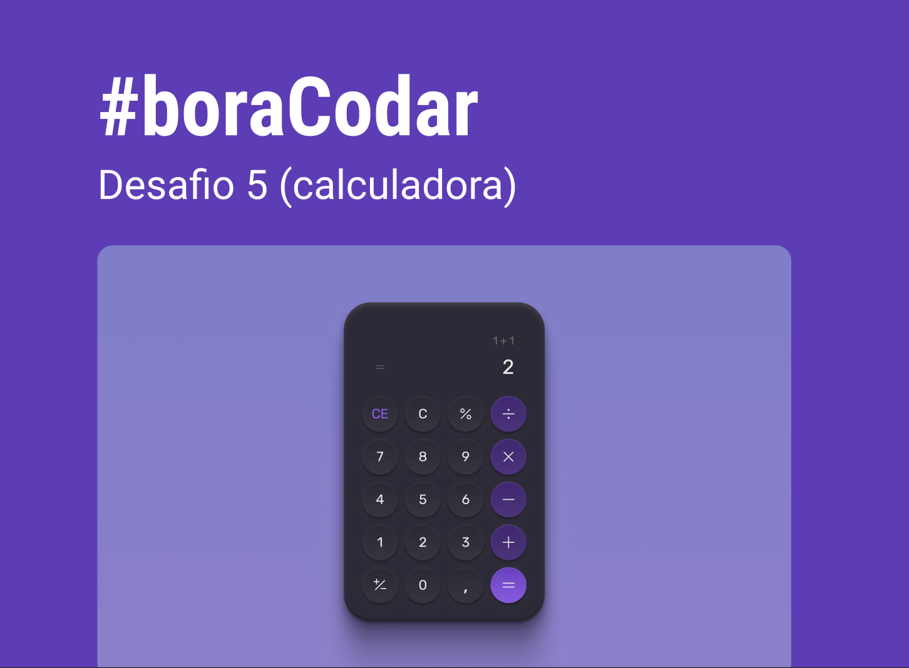

<h1 align="center"> Bora Codar </h1>

O Bora Codar é um projeto com desafios semanais.  

  <a href="#-tecnologias">Tecnologias</a>&nbsp;&nbsp;&nbsp;|&nbsp;&nbsp;&nbsp;
  <a href="#-projeto">Projeto</a>&nbsp;&nbsp;&nbsp;|&nbsp;&nbsp;&nbsp;
  <a href="#-layout">Layout</a>&nbsp;&nbsp;&nbsp;|&nbsp;&nbsp;&nbsp;
  <a href="#memo-licença">Licença</a>

  

 

  

## 🚀 Tecnologias

Esse projeto foi desenvolvido com as seguintes tecnologias:

- HTML e CSS
- JavaScript
- Git e Github
- Figma

## 💻 Projeto

O Bora Codar é um projeto ministrado pelo professor [Mayk Brito](https://github.com/maykbrito) da [Rocketseat](https://github.com/Rocketseat), aonde acontecem desafios semanais.

Projeto 05 - Calculadora.

- [Acesse o projeto finalizado, online](https://tiraupp.github.io/BoraCodar/)

## 🔖 Layout

Você pode visualizar o layout do projeto através [DESSE LINK](https://www.figma.com/community/file/1202607074523509182). É necessário ter conta no [Figma](https://figma.com) para acessá-lo.

## 📝 Licença

Esse projeto está sob a licença MIT.

---

Feito com ♥ by Tiago Raupp
